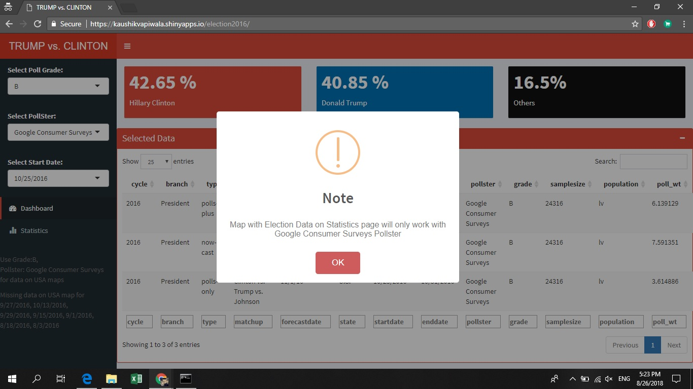
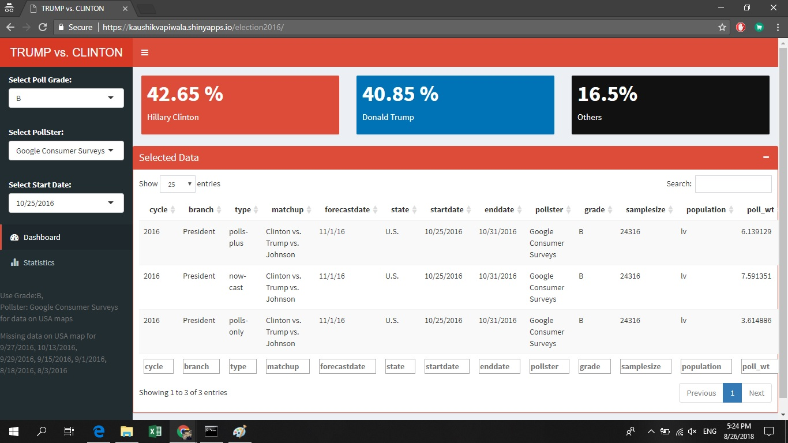
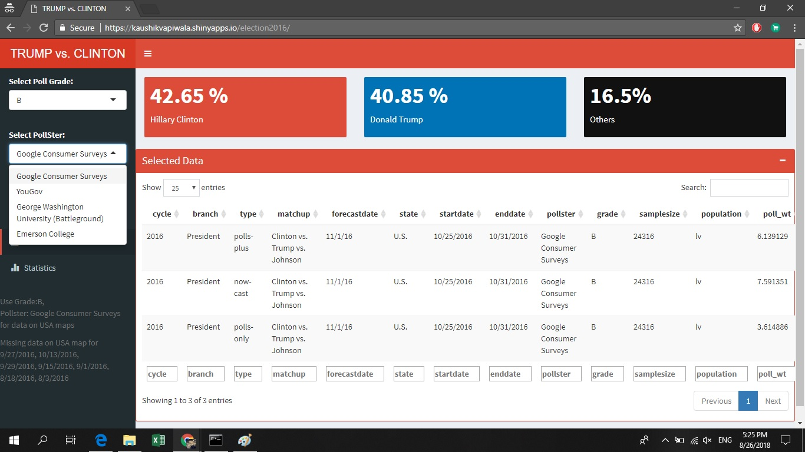
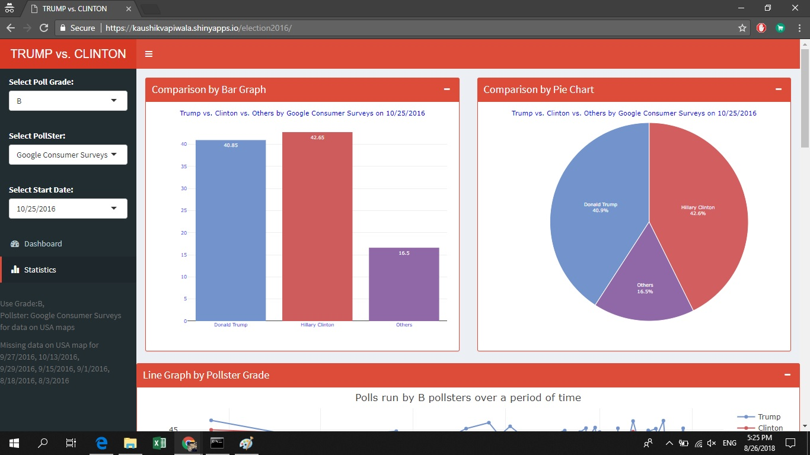
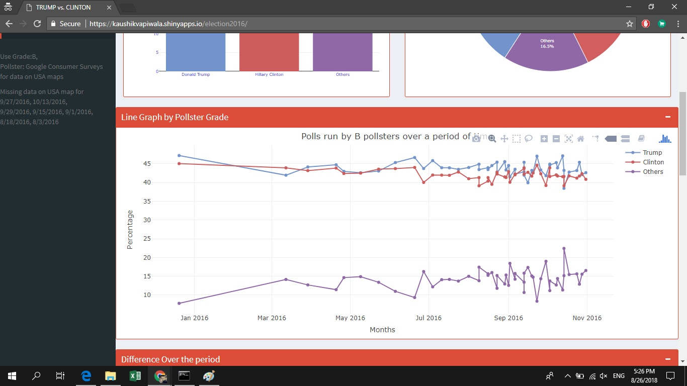
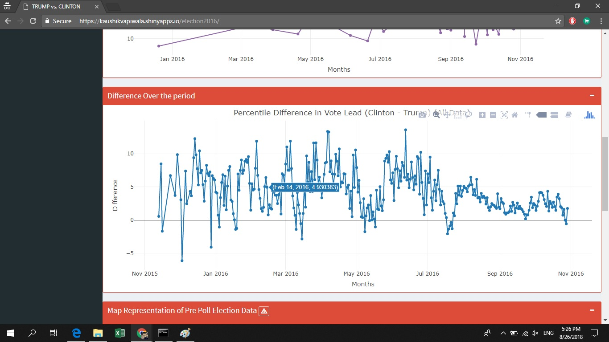
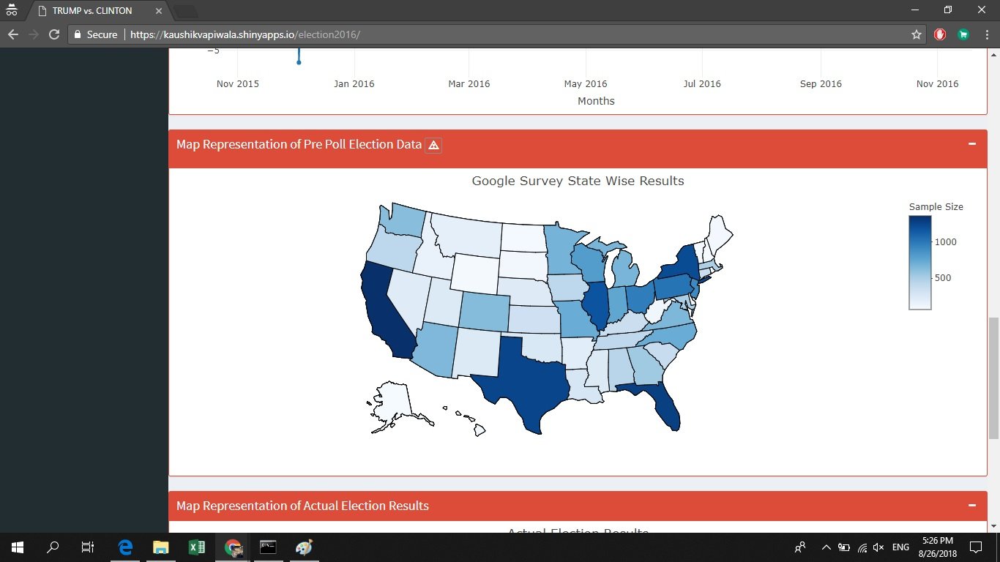
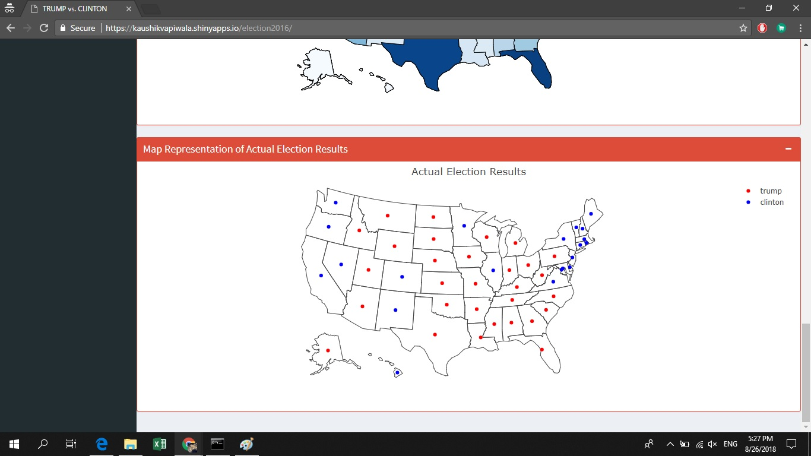

# US-Elections-2016-Analysis-and-Visualization-Using-R-Shiny-and-Plotly

The data has been is collected from Kaggle. https://www.kaggle.com/fivethirtyeight/2016-election-polls

The website is published on https://kaushikvapiwala.shinyapps.io/election2016/

<b>★ Technologies Used</b>
 • R for mathematical calculations
 • Shiny framework for data organisation and representation.
 • Plotly for data visualization.
 • React and JavaScript for Front End.

Home page
 <b>• The webpage opens with a notification for the user.</b>

 <b>• The user is then introduced with a dashboard which shows the data retrieved when certain pollster, it's grade and the date of poll is selected.

 • Consequent statistics is displayed in the "Statistics" tab. Data is displayed in the form of graphs and pie chart.

 • A Line graph is created according to a pollster grade and is displayed on a timeline of over a year. Note all the data of pollster is taken into the consideration and averaged.

 • Once again, a line graph signifies the difference in the opinion of people over a period of year. Here positive difference signifies that the Presidential Candidate Hillary Clinton is leading.

 • In the next tab, data is displayed using Choropleth Maps. The color shade signifies the sample size. Please hover the states to know more.

 • In the last tab, actual representation of the 2016 US elections result is displayed on the map.

